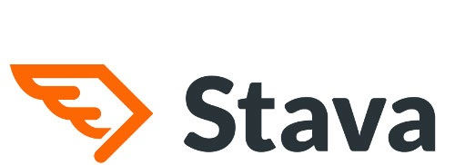

# Work in progress...

# 👋 Hi!

My name is __Michał Pokusa__ and I'm a software developer.
I'm currently working as a web developer at <a href="https://www.stava.eu/en/">__Stava__</a> 
in Opole, Poland, where I'm responsible for developing and maintaining the company's web applications and internal tools.

I'm also a student at the <a href="https://po.edu.pl/?lang=en">__Opole University of Technology__</a> where I'm pursuing a master's degree in Computer Science.

Although my main field of interest is web development, in which I've been working for the past 3 years, I also have experience in creating independent programs and scripts, Linux server administration and some SCRUM mastering. I appreciate order, peace and harmony, which I try to translate into the code I write.

<!-- # 

My primary programming language and the one I use the most is Python. During my 3 years of experience with Python, I've used it for a variety of projects, including web scraping with Selenium, web development, automation and even programming microcontrollers using CircuitPython. -->

<!-- # 

I have 2.5 years of experience with Django, which I've used to __build several web applications__. Through these years I've gained experience with a variety of Django features, including __built-in authentication system, the ORM, and its templating engine__. In addition to I have used __Celery for asynchronous tasks__ and Django __REST Framework for building RESTful APIs__. -->

<!-- # 

I have experience working with Linux, which I've used extensively as my __primary development environment__ for a number of years.
This includes tasks such as __installing and configuring software, managing users and permissions__, as well as __troubleshooting common issues__. As part of my experience with __server administration__, I've set up and managed multiple Linux servers for various projects. This includes tasks such as __configuring web servers, managing databases, and implementing security measures to protect against cyber attacks__. I'm comfortable with __automating tasks__ using scripts that streamline repetitive operations and increase productivity. -->

<!-- #### 

During my career as a software developer, I've used __Docker with docker-compose__ primarily for __containerizing and deploying__ web applications. In addition to that, I've also used it for __smaller independent applications__, multiple development environments and personal projects that included VPNs, Discord bots and game servers e.g. Minecraft. -->

<!-- 

I have extensive experience using Git for version control, having used it on a variety of projects.
As part of my experience with Git, I'm familiar with a variety of Git workflows, including feature branches, pull requests, and code reviews. I'm also confident with hosting repositories on platforms like GitHub and GitLab. -->

<!-- 

I have experience with vanilla JavaScript and some with TypeScript, which I've used to build dynamic and interactive web interfaces. I also had the opportunity to use jQuery and Vue.

Currently, I'm learning React, which I'm excited to use to build modern and responsive web applications. -->

Here are some ideas to get you started:

#### ⚡ Fun fact about me: ...

#### 🌍 I'm currently living in:
Opole, Poland 

<!-- - 🔭 I’m currently working on ...
- 🌱 I’m currently learning ...
- 👯 I’m looking to collaborate on ...
- 🤔 I’m looking for help with ...
- 💬 Ask me about ...
- : ...
- 😄 Pronouns: he / him -->

## 👨‍🏫 Lectures

...

### 🔧 Technologies I use

<!-- Tier 1 -->

<!-- Tier 2 -->

<!-- Tier 3 -->
####  

Feel free to check out my repositories to see the projects I've worked on. Thanks for stopping by! 😊

## 📫 How to reach me

You can contact me via email at: <a href="mailto:michal@pokusa.email">michal@pokusa.email</a>

It is also possible to get in touch with me on social media:

