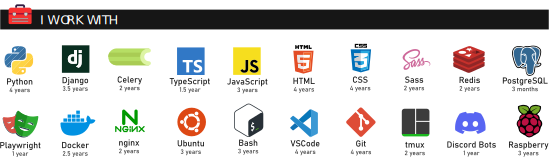

My name is <b>Michał Pokusa</b> and I'm a software developer.
I'm currently working as a web developer at
<a href="https://www.stava.eu/en/"><b>Stava</b></a>
in Opole, Poland, where I'm responsible for developing and maintaining the company's web applications and internal tools.

I'm also a student at the <a href="https://po.edu.pl/?lang=en"><b>Opole University of Technology</b></a> where I'm pursuing a master's degree in Computer Science.

Although my main field of interest is web development, in which I've been working for the past 4 years, I also have experience in creating independent programs and scripts and Linux server administration. I appreciate order, peace and harmony, which I try to translate into the code I write.

You can contact me via email at: <a href="mailto:michal@pokusa.email">michal@pokusa.email</a>

It is also possible to get in touch with me on social media:

